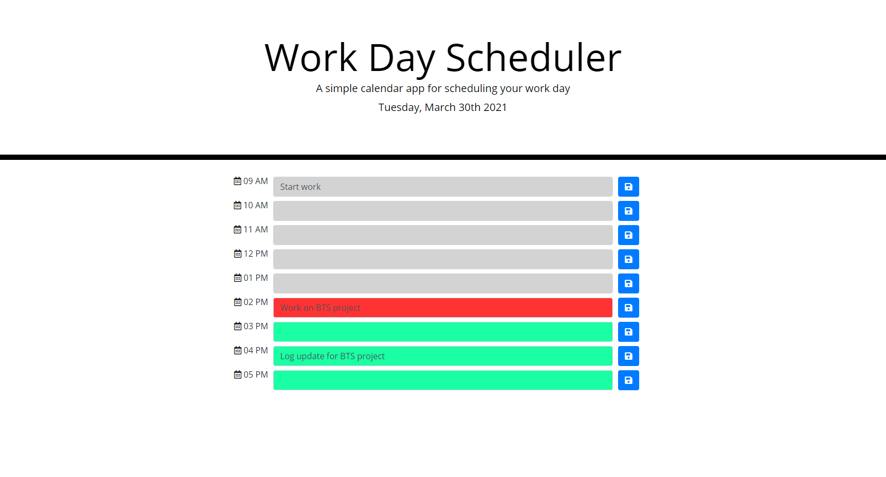

# Third-Party APIs: Work Day Scheduler

- This project is a simple calendar application.
- It allows a user to save events for each hour of the day.
- The current day and date is displayed in the header section.
- The timeblocks are color coded. The past events are colored grey, present in red and future in green. The event time indication is achieved by using moment.js
- The saved schedule is stored in local storage.

## Mockup

## Link to deployed application

https://sona29.github.io/dayschedular/
